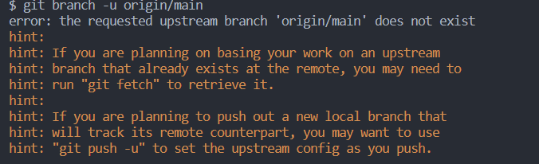

## 1、创建项目

### 1.1 项目初始化时产生的报错

背景：首次将本地仓库与远程仓库 github 仓库进行连接

- 本地仓库已经初始化完成，并进行了，放了一些文件，并进行了 add 和 commit 操作
- 远程仓库也不是空的仓库，已经有 readme 和 gitignore 文件等
- 本地仓库添加 GitHub 上的 git 仓库作为远程仓库起名 origin

```js
  git remote add origin  xxx(远程仓库地址)
```

- 本地仓库和远程仓库关联

```js
  git branch --set-upstream-to=origin/main
```

**报错** :


查看远程仓库分支`git branch -r`无法读取远程仓库分支。

**解决方法**

- 执行命令：`git pull origin main --allow-unrelated-histories`
- 执行该命令后 查看远程分支
- 再次关联上游分支`git branch --set-upstream-to=origin/main main`
- pull 远程仓库`git pull --rebase origin main` 变基 (这一步的作用？)
- push 到远程仓库
