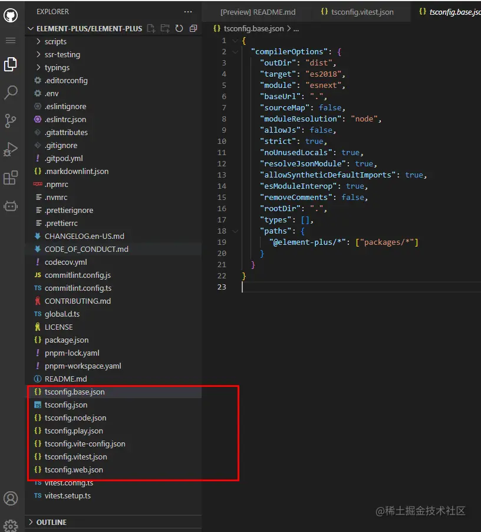

# monorepo

## 什么是 monorepo

monorepo 指的是一中代码项目结构的组织方式，mono 是指单个，repo 是指仓库，总的来说就是单个仓库，顾名思义就是把所有相关的项目放到一个仓库中进行管理

**优点**：

- 公共基础设置，不用重复配置
- 有依赖的项目之间调试开发非常方便
- 第三方库的版本管理更加简单

## 从 Vue3 源码入门级理解 pnpm 的 monorepo

vue3 在模块的拆分和设计上非常合理，模块之间的耦合度非常低，很多模块可以独立安装使用，而不需要完整的以来 vue3 运行时。这种实现除了代码层面的设计之外，最重要的还是 monorepo 对项目代码进行组织管理

### vue3 中的 monorepo

vue3 目前使用的是 pnpm 的 monorepo。
在项目根目录中新建 pnpm-workspace.yaml 文件，并声明对应的工作区就可以了

```yaml
packages:
  - "packages/*"
```

表示 packege/\*这个目录下的所有文件为 workspace 的内容

从上图可以看到 Vue3 源码整体是通过 monorepo 方式进行管理，并根据功能的不同在 packages 目录下进行划分不同的模块目录。我们可以看到每一个目录下面都一个 package.json 文件，代表每一个目录都是一个 npm 包，每个包有各自的 API、类型定义和测试模块以及 Readme 文档。这样就可以将模块拆分得更细的颗粒度，职责划分也更明确。

由于所有项目都放在一个仓库中，代码逻辑服用非常方便，如果有依赖的代码发生变动，那么用到这个依赖的项目就会立马感知到。这又是怎么做到的呢？普通项目可以通过相对路径进行引用，但我们这里的设想是每一个包都是独立，如果通过相对路径进行引用，那么就会非常耦合。所有，我们可以通过，workspace 协议进行模块之间的相互依赖，达到解耦的目的

### Workspace 协议，模块之间的相互依赖、

vue3 中，响应式方面的功能都是使用`@vue/reactivity`包的,这些包都可以在 npmjs 中下载。当本地的时候，只需要在项目的`package.json`进行下面设置

```js
{
  '@vue/reactivity:"workspace:*"',
  '@vue/runtime-core:"workspace:*"',
  '@vue/runtime-dom:"workspace:*"',

}

```

本地 workspace 包只要进行`workspace`协议，这样就依赖本地的包了，而需要从 npmjs 进行安装下载。还有一个好处就是子包相互引用代码时，使用`workspace:*`的写法来链接子包，而不是具体的版本号，可以防止多人协作时因为修改版本的遗漏而发生冲突。

通过 monorepo 方式进行管理的项目，每一个模块都可以说是一个独立的项目，同时和其他项目复用一套标准的工具和规范，无需切换开发环境。 比如我今天只修改了 reactivity 项目，那么我就可以只对 reactivity 项目进行打包处理。

`pnpm run build` 是打包所有模块，在后面加模块名称则是具体打包所加的模块名称的模块。
单独打包 reactivity 模块：
`pnpm run build reactivity`
这样就可以单独把打包出来的内容单独发布

而对 reactivity 项目进行打包处理的持续集成(CI)流程、构建和发布流程都是和其他项目共用的有的基建流程，即便将来有新的项目接入，依然可以复用现在的基建逻辑代码，这样维护和开发成本就大大降低了。

### workspace 包的版本

workspace:_后面的 _ 表示任意版本，除了 \* 还有其他：~ 、^ 符号。
当 workspace 包打包发布时，将会动态替换这些 workspace: 依赖。
假设我们上面的包的版本都是 1.0.0 ，它们的 workspace 配置如下：

```js
{
  "dependencies": {
    "@vue/reactivity": "workspace:*",
    "@vue/runtime-core": "workspace:~",
    "@vue/runtime-dom": "workspace:^"
  },
}

```

将来发包的时候，使用相关的发包工具，比如使用 changesets 来发包，该工具会帮你自动升级版本、产生 CHANGELOG 、自动替换 workspace:\* 为具体版本、自动保持版本一致性。
比如上面的代码将来发布的时候将会被转化为：

```js
{
  "dependencies": {
    "@vue/reactivity": "workspace:1.0.0",
    "@vue/runtime-core": "workspace:~1.0.0",
    "@vue/runtime-dom": "workspace:^1.0.0"
  },
}
```

[Monorepo - 优劣、踩坑、选型](https://juejin.cn/post/7215886869199896637)
[为什么越来越多的项目选择 Monorepo？](https://juejin.cn/post/7207743145999368229)

## 以 pnpm 进行 monorepo 环境的搭建

### workspace 模式

pnpm 支持 monorepo 模式的工作机制叫做 workspace 工作空间，
他要求在代码仓库的根目录下有`pnpm-workspace.yaml`文件指定那些目录作为独立的工作空间，这个工作空间可以理解为一个子模块或者 npm 包。

```
📦my-project
 ┣ 📂a
 ┃ ┗ 📜package.json
 ┣ 📂b
 ┃ ┗ 📜package.json
 ┣ 📂c
 ┃ ┣ 📂c-1
 ┃ ┃ ┗ 📜package.json
 ┃ ┣ 📂c-2
 ┃ ┃ ┗ 📜package.json
 ┃ ┗ 📂c-3
 ┃   ┗ 📜package.json
 ┣ 📜package.json
 ┣ 📜pnpm-workspace.yaml

```

```js
//pnpm-workspace.yaml
packages:
  - a
  - b
  - c/*
```

pnpm 并不是通过目录名称，而是通过目录下的 package.json 文件的 name 字段来识别仓库的包和模块

### 中枢管理操作

在 workspace 模式下，代码仓库根目录不会作为一个子模块或者 npm 包，而是**主要作为一个管理中枢，执行一些全局操作，安装一些共有的依赖**

### 子包管理操作

在 workspace 模式下，pnpm 通过`--filter`选项过滤子模块，实现对各个工作空间进行精细化操作的目的

### 实战环节，初始化 monorepo 工程

#### 创建项目文件夹并进行初始化

```bash
mkdir monorepo project
cd  monorepo project
pnpm init
```

#### 创建 pnpm-workspace.yaml 文件

`pnpm-workspace.yaml`这个文件的存在本身，会让 pnpm 要使用 monorepo 的模式管理这个项目，他的内容告诉 pnpm 哪些目录将被划分为独立的模块，这些所谓的独立模块被包管理器叫做 workspace(工作空间)。我们在这个文件中写入以下内容。

```yaml
packages:
  # 根目录下的 docs 是一个独立的文档应用，应该被划分为一个模块
  - docs
  # packages 目录下的每一个目录都作为一个独立的模块
  - packages/*
```

接下来就是建立这些工作空间，并将根目录下的`package.json`文件复制到每个工作空间中
接下来就是设置 package.json

#### 设置 package.json

明确每一个模块的属性，设置他们的 package.json 文件

##### 根目录的 package.json

```json
// openx-ui/package.json
{
  "name": "openx-ui",
  "private": true,
  "scripts": {
    // 定义脚本
    "hello": "echo 'hello world'"
  },
  "devDependencies": {
    // 定义各个模块的公共开发依赖
  }
}
```

- `private:true`:根目录在 monorepo 模式下只是一个管理中枢，它不会被发布为 npm 包 -` devDependencies`：所有模块都会有一些公共的开发依赖，例如构建工具、TypeScript、Vue、代码规范等，将公共开发依赖安装在根目录可以大幅减少子模块的依赖声明。

##### 组件包的 package.json

```json
{
  //标识信息
  "name": "@summary-project/cli",
  "version": "1.0.0",

  // 基本信息
  "description": "",
  "keywords": ["vue", "ui", "component library"],
  "author": "aky",
  "license": "MIT",
  "homepage": "git+https://github.com/xxx.git/xxx/README.md"
  "repository": {
    "type": "git",
    "url": "git+https://github.com/xxx.git"
  },
  "bugs": {
    "url" :"git+https://github.com/xxx.git/xxx/issue"
  }

  // 定义脚本，由于还没有集成实际的构建流程，这里先以打印命令代替
  "scripts": {
    "build": "echo build",
    "test": "echo test"
  },

  // 入口文件由于没有实际产物，先设置为空字符串
  "main": "",
  "module": "",
  "types": "",
  "exports": {
    ".": {
      "require": "",
      "module": "",
      "types": ""
    }
  },

  // 发布信息
  "files": [
    "dist",
    "README.md"
  ],
  // "publishConfig": {},

  // 依赖信息
  "peerDependencies": {
    "vue": ">=3.0.0"
  },
  "dependencies": {},
  "devDependencies": {}
}
```

##### 项目文档的 package.json

```json
// openx-ui/docs/package.json
{
  "name": "@openxui/docs",
  "private": true,
  "scripts": {
    // 定义脚本，由于还没有集成实际的构建流程，这里先以打印命令代替
    "dev": "echo dev",
    "build": "echo build"
  },
  "dependencies": {
    // 安装文档特有依赖
  },
  "devDependencies": {
    // 安装文档特有依赖
  }
}
```

至此,我们的 monorepo 项目雏形已经建立完毕.

[Monorepo pnpm 模式管理多个 web 项目](https://juejin.cn/post/7117897323014783013)

### monorepo 下集成 Vite

#### .npmrc 文件

安装依赖之前，先熟悉下.npmrc 文件，在根目录下建立.npmrc 文件
这个.npmrc 文件相当于项目级的 npm 配置

```ini
registry=https://registry.npm.taobao.org

```

上面的配置相当于切换 npm 镜像源为 https://registry.npm.taobao.org，只不过配置只在当前项目目录下生效，优先级高于用户设置的本地配置。

这个效果相当于`npm set config registry https://registry.npm.taobao.org`.

将一些必要的配置放在这个项目级的 .npmrc 文件中，并且将这个文件提交到代码仓，这样就可以使后续贡献的其他用户免去许多环境配置的麻烦，尤其是在公司的内网环境下，各式各样的 npm 私仓和代理配置让很多新人头疼。

当然，如果你是开源项目，就不是很推荐你在里面做网络环境相关的配置了，因为每个贡献者的网络环境是多样化的，这时项目级的 .npmrc 就只适合放一些与包管理相关的配置。

#### 安装公共项目构建依赖

接下来，就是在根目录下安装所需的构建工具：`Vite`和`Typescript`

```bash
pnpm i -wD vite typescript
```

因为每个包都需要用到 Vite 和 TypeScript 进行构建，公共开发依赖统一安装在根目录下，是可以被各个子包正常使用
由于我们要构建的是 Vue 项目，Vue 推荐的组件开发范式单文件组件 SFC 并不是原生的 Web 开发语法，所以需要一个编译为原生 js 的过程，所以我们需要引入相关的 Vite 插件`@vitejs/plugin-vue`，这个插件继承了 Vue 编译器的能力，是的构建工具可以理解 vue sfc

```bash
pnpm i -wD @vitejs/plugin-vue

```

另外需要注意，vue 应该被安装到根目录下的 dependencies，因为几乎所有子包的 peerDependencies 中都具有 vue(peerDependencies)，我们结合 pnpm 的`resolve-peers-from-workspace-root` 机制，可以统一所有子包中 vue 的版本

安装 Vue

```bash
pnpm i -wS vue
```

安装 css 预处理

```bash
pnpm i -wD sass
```

#### Vite 集成

为了成功集成 Vite，让我们的集成库构建出产物，这里我们需要完成三个步骤：

- 编写构建目标源码，目前的重点是工程化而非组件库的开发，代码层面能够体现构建要点的 demo
- 准备 vite.config 配置文件
- 在 package.json 中设置构建脚本

在集成 Vite 过程中，我们需要进行非常多的扩展

1. 对于 package 目录下的每一个组件包，我们制定更细致的源码组织规则

- 各种配置文件，如`package.json`、`vite.config.ts(js)`都放在模块根目录下
- src 目录下存放源码，其中`src/index.ts(js)`作为模块的总出口，所有需要暴露给外部供其他模块使用的方法、对象都要在这里声明导出。
- dist 目录作为产物的输出目录

2. 如果是组件库，可以在 packages 目录下新建统一出口包。如 element-plus 主包负责各个子包，并统一导出其中内容
3. 测试模块，可以根目录下新建 demo 模块，用来进行单元测试？
4. typescript，tsconfig 的测试

因为我们规定了每个模块的 dist 都作为产物输出目录，而输出产物是不需要入仓的(clone 代码后执行构建命令就能生成)，所以要注意在根目录的 .gitignore 中添加产物目录 dist：

```diff
# .gitignore
node_modules
+dist
```

#### 公共方法代码预备

**packages/shared-test**
我们假定工具方法中有一个打印 Hello World 的方法。另外，为了演示引入外部依赖的工程能力，我们还要导出一个方法 useLodash，这个方法原封不动地返回 lodash 实例对象。index.ts 会作为出口统一导出这些方法。下面展示操作步骤。

```bash
# 为 shared 包安装 lodash 相关依赖
pnpm --filter @openxui/shared i -S lodash @types/lodash
```

```js
// packages/shared/src/hello.ts
export function hello(to: string = "World") {
  const txt = `Hello ${to}!`;
  alert(txt);
  return txt;
}
```

```
// packages/shared/src/useLodash.ts
import lodash from 'lodash'

export function useLodash() {
  return lodash
}
```

```// packages/shared/src/index.ts
export * from './hello';
export * from './useLodash'
```

#### 如果需要对公共方法模块进行打包处理

们在公共方法模块 shared 包中添加 vite.config.ts，这个配置文件将告诉 vite 如何构建这个模块。
组件库项目的模块自然要以库模式构建，Vite 能够很好地支持这种构建方式，官方文档也对这种用法进行了 说明。
我们编写一个库模式下最简单的 vite.config 文件，并将 package.json 中的 build 脚本修改成 Vite 构建指令。

```js
// packages/shared-test/vite.config.ts
import { defineConfig } from "vite";

export default defineConfig({
  build: {
    // 产物输出目录，默认值就是 dist。我们使用默认值，注释掉此字段。
    // outDir: 'dist',

    // 参考：https://cn.vitejs.dev/config/build-options.html#build-lib
    lib: {
      // 构建的入口文件
      entry: "./src/index.ts",

      // 产物的生成格式，默认为 ['es', 'umd']。我们使用默认值，注释掉此字段。
      // formats: ['es', 'umd'],

      // 当产物为 umd、iife 格式时，该模块暴露的全局变量名称
      name: "summaryShared",
      // 产物文件名称
      fileName: "summary-shared",
    },
    // 为了方便学习，查看构建产物，将此置为 false，不要混淆产物代码
    minify: false,
  },
});
```

然后修改 package.json 文件 n

```diff
// packages/shared/package.json
{
  // ...
  "scripts": {
-   "build": "echo build",
+   "build": "vite build",
    "test": "echo test"
  },
}

```

之后，执行 shared-test 包的构建指令，Vite 会自动读取对应的 vite.config 文件，生成构建产物。

```bash
pnpm --filter @openxui/shared run build

# 以下为指令输出
> @openxui/shared@0.0.0 build D:\learning\openx-ui\packages\shared
> vite build

vite v4.4.4 building for production...
✓ 6 modules transformed.
dist/openxui-shared.mjs  213.46 kB │ gzip: 41.73 kB
dist/openxui-shared.umd.js  224.92 kB │ gzip: 42.24 kB
✓ built in 1.95s
```

在默认情况下，Vite 会为我们生成 .mjs 和 .umd.js 后缀的产物，可以满足绝大多数情况下对于产物格式的要求。其中 .mjs 对应 esm 格式的可用产物，.umd.js 对应 cjs 格式的可用产物。我们按照产物的路径，在 package.json 中修改对应的入口字段

```json
// packages/shared-test/package.json
{
  // 省略其他无关配置 ...
  "main": "./dist/openxui-shared.umd.js",
  "module": "./dist/openxui-shared.mjs",
  "exports": {
    ".": {
      "require": "./dist/openxui-shared.umd.js",
      "module": "./dist/openxui-shared.mjs"
      // ...
    }
  }
}
```

此时 shared-test 打包完成，具体优化打包就不做介绍了

#### typescript 集成

安装号 typescript 公共依赖后，所谓的集成就是填写`tsconfig.json`文件。大部分项目都用着相同的 tsconfig 预设，且稳定之后在迭代过程中很少修改

##### tsconfig 到底为了谁？

我们注意到，在先前集成 Vite 过程中，我们没有做任何一点 TypeScript 配置，甚至无视了 IDE 的相关报错，但是丝毫没有影响 Vite 成功解析了我们的 ts 文件，并且构建出了产物。如果你平时习惯用 Vite 脚手架生成 ts 项目，可能会感到有点反直觉，以为没有配好 ts 应该会导致构建过程出错。
其实，在 vite 官方文档中，是这样介绍的

- vite 天然支持引入.ts 文件。注意：**Vite 仅仅执行.ts 文件的转移工作，并不执行任何类型检测**。并假定类型检测已经被 IDE 或构建过程处理了

Vite 本质上是双引擎架构——内部除了 Rollup 之外，还集成了另一个构建工具 Esbuild。Esbuild 有着超快的编译速度，它在其中负责第三方库构建和 TS/JSX 语法编译。
无论是构建模式还是开发服务器模式，Vite 都通过 Esbuild 来将 ts 文件转译为 js

我们可以理解为，Vite 为了保证构建效率，内部并没有执行完整的 tsc 编译过程，而是每当遇到一个 ts 文件，就组装出一个最小化的、剔除了所有与类型检查相关配置的 tsconfig，交由 Esbuild 做转译工作——这个转译只确保生成对应的 js 产物，不做任何多余的事情。
因此，**仅仅做单文件的转译几乎不需要多少 tsconfig 配置，以至于在没有 tsconfig.json 的情况下，Vite 的转译工作都能在绝大多数情况下获得正确预期结果。**

既然如此。tsconfig 对于 vite 构建的影响如此小，，那么我们配置它更多的是为了什么？

- tsconfig 主要是写给 IDE 看的，为了让 IDE 能够实现类型检测，提示我们代码中的类型错误
- Vite 不负责类型检测，并且推荐我们在构建过程中于另一个进程单独执行类型检查，那么 tsconfig 就应该提供给执行检查任务的编译器 tsc。

##### 规划 typescript 分治策略

对整个项目的 tsconfig 配置，对于每个 tsconfig.json 文件，，我们主要从以下两个角度理解：

- 每个 tsconfig.json 将一个文件集合声明为一个 ts project，通过 include 描述集合中包含的文件、exclude 字段声明集合中需要排除的文件。注意 出了 node_modules 中的三方依赖，每个被引用的源码文件都被包含进来
- complierOptions 是编译选项，决定了 typescript 编译器在处理该 ts project 包含的文件是采取的策略和行为

```json
{
  "complierOptions": {
    //项目的编译选项
  },
  "include": {
    //项目包含哪些文件
  },
  "exclude": {
    // 在 include 包含的文件夹中需要排除哪些文件
  }
}
```

我们会将整个工程划分为多个 ts project，，应该采用什么依据划分嗯？

参考 element-plus 的划分策略**不是将每个子模块划分为一个 ts project，分散在各个包管理中，而是将功能相似的代码划分为一个`ts project`中，集中在根目录下管理**


对于每个 TypeScript 项目而言，编译选项 compilerOptions 大部分都是重复的，因此我们需要建立一个基础配置文件 `tsconfig.base.json`，供其他配置文件继承。

```json
// tsconfig.base.json
{
  "compilerOptions": {
    // 项目的根目录
    "rootDir": ".",
    // 项目基础目录
    "baseUrl": ".",
    // tsc 编译产物输出目录
    "outDir": "dist",
    // 编译目标 js 的版本
    "target": "es2022",
    //
    "module": "esnext",
    // 模块解析策略
    "moduleResolution": "node",
    // 是否生成辅助 debug 的 .map.js 文件。
    "sourceMap": false,
    // 产物不消除注释
    "removeComments": false,
    // 严格模式类型检查，建议开启
    "strict": true,
    // 不允许有未使用的变量
    "noUnusedLocals": true,
    // 允许引入 .json 模块
    "resolveJsonModule": true,

    // 与 esModuleInterop: true 配合允许从 commonjs 的依赖中直接按 import XX from 'xxx' 的方式导出 default 模块。
    "allowSyntheticDefaultImports": true,
    "esModuleInterop": true,

    // 在使用 const enum 或隐式类型导入时受到 TypeScript 的警告
    "isolatedModules": true,
    // 检查类型时是否跳过类型声明文件，一般在上游依赖存在类型问题时置为 true。
    "skipLibCheck": true,
    // 引入 ES 的功能库
    "lib": [],
    // 默认引入的模块类型声明
    "types": [],
    // 路径别名设置
    "paths": {
      "@openxui/*": ["packages/*/src"]
    }
  }
}
```

我们将所有 node 环境下执行的脚本、配置文件划分为一个 ts project。准备其配置文件`package.node.json`

```json
// tsconfig.node.json
{
  // 继承基础配置
  "extends": "./tsconfig.base.json",
  "compilerOptions": {
    // 该 ts project 将被视作一个部分，通过项目引用(Project References)功能集成到一个 tsconfig.json 中
    "composite": true,
    // node 脚本没有 dom 环境，因此只集成 esnext 库即可
    "lib": ["ESNext"],
    // 集成 Node.js 库函数的类型声明
    "types": ["node"],
    // 脚本有时会以 js 编写，因此允许 js
    "allowJs": true
  },
  "include": [
    // 目前项目中暂时只有配置文件，如 vite.config.ts，以后会逐步增加
    "**/*.config.*"
  ],
  "exclude": [
    // 暂时先排除产物目录，packages/xxx/dist/x.config.js 或者 node_modules/pkg/x.config.js 不会被包含进来
    "**/dist",
    "**/node_modules"
  ]
}
```

对于所有模块中 src 目录下的源码文件，它们几乎都是组件库的实现代码，大多要求浏览器环境下特有的 API(例如 DOM API)，且相互之间存在依赖关系。我们创建 `tsconfig.src.json` 将它们划入同一个 ts project 中。

```json
// tsconfig.src.json
{
  // 继承基础配置
  "extends": "./tsconfig.base.json",
  "compilerOptions": {
    "composite": true,
    // 组件库依赖浏览器的 DOM API
    "lib": ["ESNext", "DOM", "DOM.Iterable"],
    "types": ["node"]
  },
  "include": ["typings/env.d.ts", "packages/**/src"]
}
```

到此，IDE 还是无法正常提供类型服务，我们最终还是要在根目录建立一个总的 tsconfig.json，通过 项目引用(Project References)功能 将多个 compilerOptions.composite = true 的 ts project 聚合在一起，这样 IDE 才能够识别。

```json
// tsconfig.json
{
  "compilerOptions": {
    "target": "es2022",
    "moduleResolution": "node",

    // vite 会读取到这个 tsconfig 文件(位于工作空间根目录)，按照其推荐配置这两个选项
    // https://cn.vitejs.dev/guide/features.html#typescript-compiler-options
    "isolatedModules": true,
    "useDefineForClassFields": true
  },
  "files": [],
  "references": [
    // 聚合 ts project
    { "path": "./tsconfig.src.json" },
    { "path": "./tsconfig.node.json" }
  ]
}
```

项目引用特性，简单理解就是为醒目的不同于部分应用不同的 tsconfig 能力，

参考：

- [【从 0 到 1 搭建 Vue 组件库框架】2. 在 monorepo 模式下集成 Vite 和 TypeScript - 上](https://juejin.cn/post/7257519248053436473)
- [【从 0 到 1 搭建 Vue 组件库框架】2. 在 monorepo 模式下集成 Vite 和 TypeScript - 下](https://juejin.cn/post/7257517788205367351)
- [Monorepo pnpm 模式管理多个 web 项目](https://juejin.cn/post/7117897323014783013)
