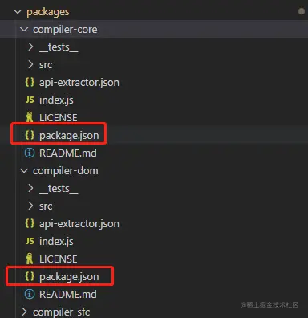

# monorepo

## 什么是 monorepo

monorepo 指的是一中代码项目结构的组织方式，mono 是指单个，repo 是指仓库，总的来说就是单个仓库，顾名思义就是把所有相关的项目放到一个仓库中进行管理

**优点**：

- 公共基础设置，不用重复配置
- 有依赖的项目之间调试开发非常方便
- 第三方库的版本管理更加简单

## 从 Vue3 源码入门级理解 pnpm 的 monorepo

vue3 在模块的拆分和设计上非常合理，模块之间的耦合度非常低，很多模块可以独立安装使用，而不需要完整的以来 vue3 运行时。这种实现除了代码层面的设计之外，最重要的还是 monorepo 对项目代码进行组织管理

### vue3 中的 monorepo

vue3 目前使用的是 pnpm 的 monorepo。
在项目根目录中新建 pnpm-workspace.yaml 文件，并声明对应的工作区就可以了

```yaml
packages:
  - "packages/*"
```

表示 packege/\*这个目录下的所有文件为 workspace 的内容

从上图可以看到 Vue3 源码整体是通过 monorepo 方式进行管理，并根据功能的不同在 packages 目录下进行划分不同的模块目录。我们可以看到每一个目录下面都一个 package.json 文件，代表每一个目录都是一个 npm 包，每个包有各自的 API、类型定义和测试模块以及 Readme 文档。这样就可以将模块拆分得更细的颗粒度，职责划分也更明确。

由于所有项目都放在一个仓库中，代码逻辑服用非常方便，如果有依赖的代码发生变动，那么用到这个依赖的项目就会立马感知到。这又是怎么做到的呢？普通项目可以通过相对路径进行引用，但我们这里的设想是每一个包都是独立，如果通过相对路径进行引用，那么就会非常耦合。所有，我们可以通过，workspace 协议进行模块之间的相互依赖，达到解耦的目的

### Workspace 协议，模块之间的相互依赖、

vue3 中，响应式方面的功能都是使用`@vue/reactivity`包的,这些包都可以在 npmjs 中下载。当本地的时候，只需要在项目的`package.json`进行下面设置

```js
{
  '@vue/reactivity:"workspace:*"',
  '@vue/runtime-core:"workspace:*"',
  '@vue/runtime-dom:"workspace:*"',

}

```

本地 workspace 包只要进行`workspace`协议，这样就依赖本地的包了，而需要从 npmjs 进行安装下载。还有一个好处就是子包相互引用代码时，使用`workspace:*`的写法来链接子包，而不是具体的版本号，可以防止多人协作时因为修改版本的遗漏而发生冲突。

通过 monorepo 方式进行管理的项目，每一个模块都可以说是一个独立的项目，同时和其他项目复用一套标准的工具和规范，无需切换开发环境。 比如我今天只修改了 reactivity 项目，那么我就可以只对 reactivity 项目进行打包处理。

`pnpm run build` 是打包所有模块，在后面加模块名称则是具体打包所加的模块名称的模块。
单独打包 reactivity 模块：
`pnpm run build reactivity`
这样就可以单独把打包出来的内容单独发布

而对 reactivity 项目进行打包处理的持续集成(CI)流程、构建和发布流程都是和其他项目共用的有的基建流程，即便将来有新的项目接入，依然可以复用现在的基建逻辑代码，这样维护和开发成本就大大降低了。

### workspace 包的版本

workspace:_后面的 _ 表示任意版本，除了 \* 还有其他：~ 、^ 符号。
当 workspace 包打包发布时，将会动态替换这些 workspace: 依赖。
假设我们上面的包的版本都是 1.0.0 ，它们的 workspace 配置如下：

```js
{
  "dependencies": {
    "@vue/reactivity": "workspace:*",
    "@vue/runtime-core": "workspace:~",
    "@vue/runtime-dom": "workspace:^"
  },
}

```

将来发包的时候，使用相关的发包工具，比如使用 changesets 来发包，该工具会帮你自动升级版本、产生 CHANGELOG 、自动替换 workspace:\* 为具体版本、自动保持版本一致性。
比如上面的代码将来发布的时候将会被转化为：

```js
{
  "dependencies": {
    "@vue/reactivity": "workspace:1.0.0",
    "@vue/runtime-core": "workspace:~1.0.0",
    "@vue/runtime-dom": "workspace:^1.0.0"
  },
}
```

[Monorepo - 优劣、踩坑、选型](https://juejin.cn/post/7215886869199896637)
[为什么越来越多的项目选择 Monorepo？](https://juejin.cn/post/7207743145999368229)

## 以 pnpm 进行 monorepo 环境的搭建

### workspace 模式

pnpm 支持 monorepo 模式的工作机制叫做 workspace 工作空间，
他要求在代码仓库的根目录下有`pnpm-workspace.yaml`文件指定那些目录作为独立的工作空间，这个工作空间可以理解为一个子模块或者 npm 包。

```
📦my-project
 ┣ 📂a
 ┃ ┗ 📜package.json
 ┣ 📂b
 ┃ ┗ 📜package.json
 ┣ 📂c
 ┃ ┣ 📂c-1
 ┃ ┃ ┗ 📜package.json
 ┃ ┣ 📂c-2
 ┃ ┃ ┗ 📜package.json
 ┃ ┗ 📂c-3
 ┃   ┗ 📜package.json
 ┣ 📜package.json
 ┣ 📜pnpm-workspace.yaml

```

```js
//pnpm-workspace.yaml
packages:
  - a
  - b
  - c/*
```

pnpm 并不是通过目录名称，而是通过目录下的 package.json 文件的 name 字段来识别仓库的包和模块

### 中枢管理操作

在 workspace 模式下，代码仓库根目录不会作为一个子模块或者 npm 包，而是**主要作为一个管理中枢，执行一些全局操作，安装一些共有的依赖**

### 子包管理操作

在 workspace 模式下，pnpm 通过`--filter`选项过滤子模块，实现对各个工作空间进行精细化操作的目的

### 实战环节，初始化 monorepo 工程

#### 创建项目文件夹并进行初始化

```bash
mkdir monorepo project
cd  monorepo project
pnpm init
```

#### 创建 pnpm-workspace.yaml 文件

`pnpm-workspace.yaml`这个文件的存在本身，会让 pnpm 要使用 monorepo 的模式管理这个项目，他的内容告诉 pnpm 哪些目录将被划分为独立的模块，这些所谓的独立模块被包管理器叫做 workspace(工作空间)。我们在这个文件中写入以下内容。

```yaml
packages:
  # 根目录下的 docs 是一个独立的文档应用，应该被划分为一个模块
  - docs
  # packages 目录下的每一个目录都作为一个独立的模块
  - packages/*
```

接下来就是建立这些工作空间，并将根目录下的`package.json`文件复制到每个工作空间中
接下来就是设置 package.json

#### 设置 package.json

明确每一个模块的属性，设置他们的 package.json 文件

##### 根目录的 package.json

```json
// openx-ui/package.json
{
  "name": "openx-ui",
  "private": true,
  "scripts": {
    // 定义脚本
    "hello": "echo 'hello world'"
  },
  "devDependencies": {
    // 定义各个模块的公共开发依赖
  }
}
```

- `private:true`:根目录在 monorepo 模式下只是一个管理中枢，它不会被发布为 npm 包 -` devDependencies`：所有模块都会有一些公共的开发依赖，例如构建工具、TypeScript、Vue、代码规范等，将公共开发依赖安装在根目录可以大幅减少子模块的依赖声明。

##### 组件包的 package.json

```json
{
  //标识信息
  "name": "@summary-project/cli",
  "version": "1.0.0",

  // 基本信息
  "description": "",
  "keywords": ["vue", "ui", "component library"],
  "author": "aky",
  "license": "MIT",
  "homepage": "git+https://github.com/xxx.git/xxx/README.md"
  "repository": {
    "type": "git",
    "url": "git+https://github.com/xxx.git"
  },
  "bugs": {
    "url" :"git+https://github.com/xxx.git/xxx/issue"
  }

  // 定义脚本，由于还没有集成实际的构建流程，这里先以打印命令代替
  "scripts": {
    "build": "echo build",
    "test": "echo test"
  },

  // 入口文件由于没有实际产物，先设置为空字符串
  "main": "",
  "module": "",
  "types": "",
  "exports": {
    ".": {
      "require": "",
      "module": "",
      "types": ""
    }
  },

  // 发布信息
  "files": [
    "dist",
    "README.md"
  ],
  // "publishConfig": {},

  // 依赖信息
  "peerDependencies": {
    "vue": ">=3.0.0"
  },
  "dependencies": {},
  "devDependencies": {}
}
```

##### 项目文档的 package.json

```json
// openx-ui/docs/package.json
{
  "name": "@openxui/docs",
  "private": true,
  "scripts": {
    // 定义脚本，由于还没有集成实际的构建流程，这里先以打印命令代替
    "dev": "echo dev",
    "build": "echo build"
  },
  "dependencies": {
    // 安装文档特有依赖
  },
  "devDependencies": {
    // 安装文档特有依赖
  }
}
```

至此,我们的 monorepo 项目雏形已经建立完毕.
