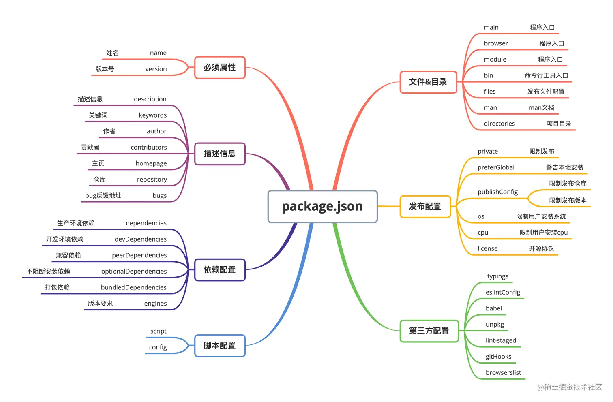

package.json 比较完整的文件

```json
{
  "name":"aky",,   // 名称 必填
  "version":"0.1.1", //版本号 必填
  "description":"a example file",
  "keywords":"example",
  "homepage":"https://aky.com",  //项目的主页地址
  "bugs":{               //用于项目问题的反馈issue地址或者一个邮箱
    "url":"https://path/to/bug",
    "email":"aky@xxx.com"
  },
  "license":"MIT",   //开源协议
  "author":"aky",  //作者
  "contributors":[    //项目参与者
    {
      "name":"aky",
      "email":"sky@xxxx.com",
      "url":"https://aaaa.com"
    }
  ],
  // 属性的值是一个数组，内容是模块下文件名或者文件夹名，
  //如果是文件夹名，则文件夹下所有文件都会被包含进来
  "flies":"",

  "main":"./dist/default.js",  //入口文件
  "bin":"",   //用来指定每个内部命令对应的可执行文件，
  "man":[ "./doc/calc.1" ],  //用来指定当前模块的man文档 位置
  "directories":"", //制定一些方法来描述模块的结构, 用于告诉用户每个目录在什么位置。

  "repository":{   //指定一个代码存放地址，对想要为你的项目贡献代码的人有帮助
    "type":"git",
    "url":"https://path/to/url"
  },
  "script":{
    "start":"webpack serve --config webpack.config.dev.js --progress"
  },

  "config":{  //字段用于添加命令行的环境变量。

    "port":8088
  },
  "dependencies": {},
  "devDependencies": {
    "@babel/core": "^7.14.3",
        "@babel/preset-env": "^7.14.4",
        "@babel/preset-react": "^7.13.13",
        "babel-loader": "^8.2.2",
        "babel-plugin-import": "^1.13.3",
        "glob": "^7.1.7",
        "less": "^3.9.0",
        "less-loader": "^9.0.0",
        "style-loader": "^2.0.0",
        "webpack": "^5.38.1",
        "webpack-cli": "^4.7.0",
        "webpack-dev-server": "^3.11.2"

  },
  "peerDependencies":{
    "tea":"2.x"
  },
  "bundleDependencies":{  //指定发布的时候会被一起打包的模块.
    "renderized", "super-streams"
  }，
  "engines":{  //指定该模块运行的平台
    "node":"super-stream"
  },
	"os" : [ "win32", "darwin", "linux"], //运行的操作系统
  "cpu" : [ "x64", "ia32" ], //运行的cpu
  "private": false, //如果这个属性被设置为true，npm将拒绝发布它，这是为了防止一个私有模块被无意间发布出去。
  "publishConfig": {}
}

```

### bin 字段

bin 项用来指定每个内部命令对应的可执行文件的位置。如果你编写的是一个 node 工具的时候一定会用到 bin 字段。

当我们编写一个 cli 工具的时候，需要指定工具的运行命令，比如常用的 webpack 模块，他的运行命令就是 webpack。

···js
"bin": {
"webpack": "bin/index.js",
}

···
当我们执行 webpack 命令的时候就会执行 bin/index.js 文件中的代码。
在模块以依赖的方式被安装，如果存在 bin 选项。在 node_modules/.bin/生成对应的文件，
Npm 会寻找这个文件，在 node_modules/.bin/目录下建立符号链接。由于 node_modules/.bin/目录会在运行时加入系统的 PATH 变量，因此在运行 npm 时，就可以不带路径，直接通过命令来调用这些脚本。

### config 字段

config 字段用于添加命令行的环境变量。

```js
{
  "name" : "yindong",
  "config" : { "port" : "8080" },
  "scripts" : { "start" : "node server.js" }
}

```

然后，在 server.js 脚本就可以引用 config 字段的值。

```js
console.log(process.env.npm_package_config_port); // 8080
```

用户可以通过 npm config set 来修改这个值。

```
npm config set yindong:port 8000

```

### peerDependencies

当我们开发一个模块的时候，如果当前模块与所依赖的模块同时依赖一个第三方模块，并且依赖的是两个不兼容的版本时就会出现问题。
比如，你的项目依赖 A 模块和 B 模块的 1.0 版，而 A 模块本身又依赖 B 模块的 2.0 版
大多数情况下，这不构成问题，B 模块的两个版本可以并存，同时运行。但是，有一种情况，会出现问题，就是这种依赖关系将暴露给用户。

最典型的场景就是插件，比如 A 模块是 B 模块的插件。用户安装的 B 模块是 1.0 版本，但是 A 插件只能和 2.0 版本的 B 模块一起使用。
这时，用户要是将 1.0 版本的 B 的实例传给 A，就会出现问题。因此，需要一种机制，在模板安装的时候提醒用户，如果 A 和 B 一起安装，那么 B 必须是 2.0 模块。
peerDependencies 字段，就是用来供插件指定其所需要的主工具的版本。可以通过 peerDependencies 字段来限制，使用 myless 模块必须依赖 less 模块的 3.9.x 版本.

```js
{
  "name": "myless",
  "peerDependencies": {
    "less": "3.9.x"
  }
}
```

### publishConfig

这个配置是会在模块发布时生效，用于设置发布用到的一些值的集合。如果你不想模块被默认标记为最新的，或者默认发布到公共仓库，可以在这里配置 tag 或仓库地址。
通常 publishConfig 会配合 private 来使用，如果你只想让模块被发布到一个特定的 npm 仓库，如一个内部的仓库。

```js
"private": true,
"publishConfig": {
  "tag": "1.0.0",
  "registry": "https://registry.npmjs.org/",
  "access": "public"
}
```


